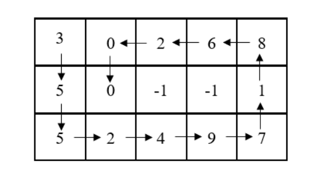
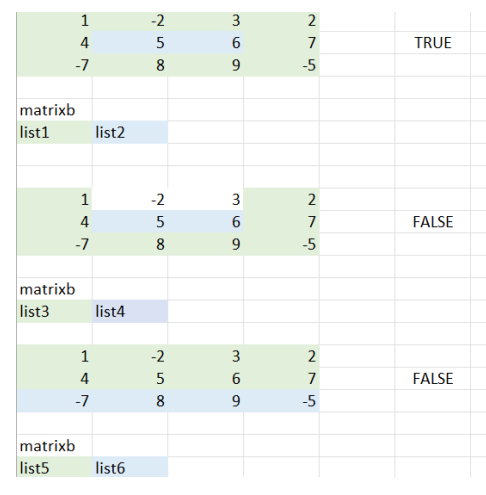

# CMPE 223 Project - Linkes List Applications
As a homework assignment, we were expected to write some programs which run by using our own implementation of Linked List, Stack and Queue structure in order to complete the tasks. 

## Question 1 - Part A

The program should return the elements of the matix, which are given in the txt files, in spiral form. It should stop when it sees -1. It should start from the top right and go down until the end of the column and then right until the end of the row, up to the top and left.

For this example the sequence should be as follows:

3 → 5 → 5 → 2 → 4 → 9 → 7 → 1 → 8 → 6 → 2 → 0 → 0

Example Input/Output:

    Input filename:matrix.txt

    [3, 5, 5, 2, 4, 9, 7, 1, 8, 6, 2, 0, 0]

## Question 1 - Part B

The program checks if the given list are neighbor by looking at the node to the right, left, under and above. The direction of the arrow is the same with Question 1A, but this time it should should read 3 txt file, the first is the matrixb, the second and the third are the lists with the indices of the matrices. It will return TRUE or FALSE.

Example Input/Output:

    Input filename:matrixb.txt
    
    Input filename:list1.txt
    
    Input filename:list2.txt
    
    TRUE

Visual representation of the working system:

## Question 2

The program should return some values by checking that if the number is less than or equal to the numbers from itself and the days before?

Example Input/Output:

    Input filename:price2.txt

    [90, 65, 70, 60, 75, 80]

    [1, 2, 1, 4, 1, 1]
    

